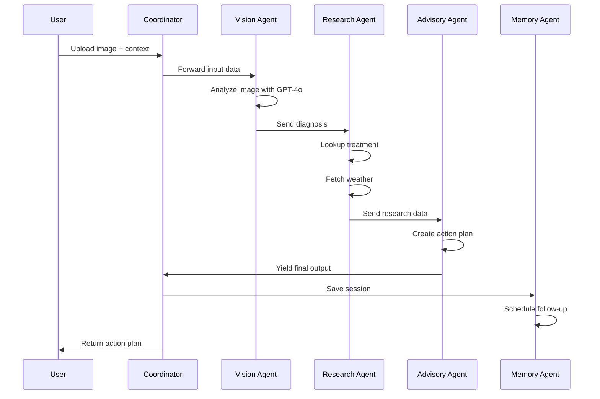

# Architecture Documentation - AI Krishi Sahayak

## 🏗️ System Architecture

### High-Level Overview

```
┌─────────────────────────────────────────────────────────────┐
│                    USER INTERFACE LAYER                      │
│  ┌───────────┐  ┌───────────┐  ┌───────────┐              │
│  │    CLI    │  │  Web App  │  │ WhatsApp  │  (Future)    │
│  │ (current) │  │  (future) │  │   Bot     │              │
│  └─────┬─────┘  └─────┬─────┘  └─────┬─────┘              │
└────────┼──────────────┼──────────────┼─────────────────────┘
         │              │              │
         └──────────────┴──────────────┘
                        │
         ┌──────────────▼──────────────┐
         │   COORDINATOR AGENT         │
         │  (main.py)                  │
         │  - Workflow orchestration   │
         │  - Error handling           │
         │  - Result aggregation       │
         └──────────────┬──────────────┘
                        │
         ┌──────────────┴──────────────┐
         │                             │
┌────────▼────────┐            ┌───────▼────────┐
│  AGENT LAYER    │            │  MEMORY LAYER  │
│                 │            │                │
│ ┌─────────────┐ │            │ ┌────────────┐ │
│ │Vision Agent │ │            │ │SQLite DB   │ │
│ └──────┬──────┘ │            │ ├────────────┤ │
│        │        │            │ │Users       │ │
│ ┌──────▼──────┐ │            │ │Sessions    │ │
│ │Research     │ │◄───────────┤ │Follow-ups  │ │
│ │Agent        │ │            │ │History     │ │
│ └──────┬──────┘ │            │ └────────────┘ │
│        │        │            └────────────────┘
│ ┌──────▼──────┐ │
│ │Advisory     │ │
│ │Agent        │ │
│ └─────────────┘ │
└─────────────────┘
         │
┌────────▼─────────────────────────────────────┐
│         EXTERNAL SERVICES                    │
│  ┌──────────┐  ┌──────────┐  ┌────────────┐ │
│  │GitHub    │  │OpenAI    │  │Weather API │ │
│  │Models    │  │Azure AI  │  │            │ │
│  └──────────┘  └──────────┘  └────────────┘ │
└──────────────────────────────────────────────┘
```

---

## 🤖 Agent Details

### 1. Vision Agent
**File**: `agents/vision_agent.py`

**Responsibilities:**
- Accepts plant images as input
- Encodes images to base64
- Sends to GPT-4o vision model
- Parses disease diagnosis
- Extracts confidence scores and symptoms

**Input:**
```python
{
    "image_path": "path/to/image.jpg",
    "user_id": "farmer001",
    "additional_context": "Brown spots appeared",
    "timestamp": "2024-..."
}
```

**Output:**
```python
{
    "image_path": "path/to/image.jpg",
    "diagnosis": "{...JSON...}",
    "user_id": "farmer001",
    "timestamp": "..."
}
```

**Key Features:**
- GPT-4o multimodal analysis
- Structured JSON output
- Disease confidence scoring
- Symptom identification

---

### 2. Research Agent
**File**: `agents/research_agent.py`

**Responsibilities:**
- Receives diagnosis from Vision Agent
- Looks up treatment in knowledge base
- Fetches weather data from API
- Compiles safety guidelines
- Estimates treatment costs

**Input:**
```python
{
    "diagnosis": "{...}",
    "location": "Pune",
    "user_id": "farmer001"
}
```

**Output:**
```python
{
    "diagnosis": "{...}",
    "research": "Treatment recommendations...",
    "treatment_info": {...},
    "weather": {...},
    "user_id": "farmer001"
}
```

**External APIs:**
- OpenWeatherMap API (weather)
- Internal knowledge base (diseases)

---

### 3. Advisory Agent
**File**: `agents/advisory_agent.py`

**Responsibilities:**
- Receives technical data from Research Agent
- Translates to farmer-friendly language
- Creates step-by-step action plans
- Adds timeline and cost info
- Formats output with emojis and structure

**Input:**
```python
{
    "diagnosis": "{...}",
    "research": "...",
    "treatment_info": {...},
    "weather": {...}
}
```

**Output:**
```python
{
    "user_id": "farmer001",
    "diagnosis_summary": "...",
    "action_plan": "🌱 PROBLEM...",
    "follow_up_required": true,
    "follow_up_days": 2
}
```

**Key Features:**
- Simple language translation
- Emoji-based formatting
- Cultural appropriateness
- Safety emphasis

---

### 4. Memory Agent
**File**: `agents/memory_agent.py`

**Responsibilities:**
- Persistent data storage in SQLite
- User profile management
- Session tracking
- Follow-up scheduling
- Pattern analysis

**Database Schema:**
```sql
users (
    user_id TEXT PRIMARY KEY,
    name TEXT,
    location TEXT,
    phone TEXT,
    created_at TIMESTAMP
)

farm_sessions (
    session_id INTEGER PRIMARY KEY,
    user_id TEXT,
    image_path TEXT,
    disease_detected TEXT,
    confidence REAL,
    diagnosis_json TEXT,
    action_plan TEXT,
    created_at TIMESTAMP
)

follow_ups (
    follow_up_id INTEGER PRIMARY KEY,
    session_id INTEGER,
    user_id TEXT,
    scheduled_date DATE,
    status TEXT,
    notes TEXT,
    completed_at TIMESTAMP
)

disease_history (
    history_id INTEGER PRIMARY KEY,
    user_id TEXT,
    plant_type TEXT,
    disease_name TEXT,
    occurrence_date TIMESTAMP,
    treatment_applied TEXT,
    outcome TEXT
)
```

---

## 🔄 Workflow Execution

### Sequential Flow



### Event Streaming

The workflow uses `run_stream()` for real-time event monitoring:

```python
async for event in workflow.run_stream(input_data):
    if isinstance(event, WorkflowStatusEvent):
        # Track workflow state changes
    elif isinstance(event, WorkflowOutputEvent):
        # Capture final output
    elif isinstance(event, ExecutorFailedEvent):
        # Handle errors
```

**Event Types:**
- `WorkflowStatusEvent` - State changes (IN_PROGRESS, IDLE, etc.)
- `ExecutorInvokedEvent` - Agent starts processing
- `ExecutorCompletedEvent` - Agent finishes
- `WorkflowOutputEvent` - Final output yielded
- `ExecutorFailedEvent` - Error occurred

---

## 🗄️ Data Flow

### Input Processing
```
User Input
    ↓
Coordinator validates
    ↓
Vision Agent receives
    ↓
Image → Base64 encoding
    ↓
GPT-4o API call
    ↓
JSON diagnosis
```

### Data Transformation
```
Technical Diagnosis
    ↓
Knowledge Base Lookup
    ↓
Weather API Integration
    ↓
Research Compilation
    ↓
Farmer-Friendly Translation
    ↓
Actionable Plan
```

### Output Generation
```
Action Plan (text)
    ↓
Memory Storage
    ↓
Follow-up Scheduling
    ↓
User Delivery (CLI/API)
```

---

## 🔌 External Integrations

### GitHub Models API
**Endpoint**: `https://models.github.ai/inference`
**Authentication**: GitHub Personal Access Token
**Models Used**: `openai/gpt-4o`

**Usage:**
```python
from agent_framework.azure import AzureOpenAIChatClient

client = AzureOpenAIChatClient(
    endpoint="https://models.github.ai/inference",
    api_key=GITHUB_TOKEN,
    model_name="gpt-4o"
)
```

### OpenWeatherMap API
**Endpoint**: `http://api.openweathermap.org/data/2.5/weather`
**Authentication**: API Key
**Data**: Current weather conditions

**Response:**
```json
{
    "main": {
        "temp": 28.5,
        "humidity": 65
    },
    "weather": [{
        "description": "partly cloudy"
    }]
}
```

---

## 🛡️ Error Handling

### Agent-Level Errors
Each agent implements try-catch blocks:
```python
try:
    # Agent logic
    result = await self.agent.run(message)
except Exception as e:
    print(f"Error in {self.id}: {e}")
    # Fallback behavior
```

### Workflow-Level Errors
Coordinator monitors for failures:
```python
if isinstance(event, ExecutorFailedEvent):
    print(f"Agent {event.executor_id} failed")
    # Log error, notify user
```

### API Errors
Graceful degradation:
- Weather API unavailable → Continue without weather
- Vision API error → Return helpful error message
- Database error → Log but don't crash

---

## 🔐 Security Considerations

### Current Implementation
- ✅ API keys stored in `.env` (not in code)
- ✅ `.gitignore` prevents key commits
- ✅ Local SQLite (no cloud exposure)
- ✅ Image processing without storage

### Production Requirements
- 🔄 Implement OAuth for user auth
- 🔄 Encrypt sensitive data in database
- 🔄 Rate limiting on API calls
- 🔄 Input validation and sanitization
- 🔄 HTTPS for all communications

---

## 📈 Scalability

### Current Bottlenecks
1. **Sequential Processing**: Agents run one after another
2. **Single Database**: SQLite not for concurrent access
3. **Local Storage**: Images saved locally

### Scaling Strategies

#### Phase 1: Optimize Current
- ✅ Already using async/await
- 🔄 Add caching for common diagnoses
- 🔄 Batch weather API calls

#### Phase 2: Horizontal Scaling
- 🔄 Replace SQLite with PostgreSQL
- 🔄 Add Redis for caching
- 🔄 Use blob storage for images
- 🔄 Deploy agents as microservices

#### Phase 3: Distributed
- 🔄 Kubernetes for orchestration
- 🔄 Message queue (RabbitMQ/Kafka)
- 🔄 CDN for image delivery
- 🔄 Load balancers

---

## 🧪 Testing Strategy

### Unit Tests
```python
# test_vision_agent.py
async def test_vision_agent_analysis():
    agent = VisionAgent(mock_client)
    result = await agent.analyze_image(test_data)
    assert result['diagnosis'] is not None
```

### Integration Tests
```python
# test_workflow.py
async def test_full_workflow():
    coordinator = KrishiSahayakCoordinator()
    result = await coordinator.diagnose_plant(...)
    assert 'action_plan' in result
```

### Load Tests
- Simulate 100 concurrent users
- Measure response times
- Monitor API rate limits

---

## 📊 Monitoring & Observability

### Logging
```python
import logging

logger = logging.getLogger(__name__)
logger.info("Vision agent started")
logger.error("API call failed", exc_info=True)
```

### Metrics to Track
- API response times
- Agent execution times
- Error rates
- User satisfaction scores
- Database query performance

### Tools
- **Local**: Python `logging` module
- **Production**: Azure Monitor, DataDog, or New Relic

---

## 🔮 Future Architecture Enhancements

### Additional Agents
1. **Crop Planning Agent** - Seasonal recommendations
2. **Market Price Agent** - Real-time pricing
3. **Soil Analysis Agent** - Lab report interpretation
4. **Insurance Agent** - Claim assistance

### Advanced Features
- **Multi-language Support** - Translation agents
- **Voice Interface** - Speech-to-text integration
- **Image History** - Track disease progression
- **Community Features** - Farmer forums

### Mobile Architecture
```
Mobile App (React Native)
    ↓
REST API (FastAPI)
    ↓
Coordinator Agent
    ↓
Agent Workflows
```

---

## 📚 References

- [Microsoft Agent Framework](https://github.com/microsoft/agent-framework)
- [GitHub Models Documentation](https://github.com/marketplace/models)
- [OpenAI API Reference](https://platform.openai.com/docs)
- [Agent Pattern Best Practices](https://microsoft.github.io/agent-framework/)

---

**Document Version**: 1.0  
**Last Updated**: November 30, 2024  
**Author**: AI Krishi Sahayak Team
